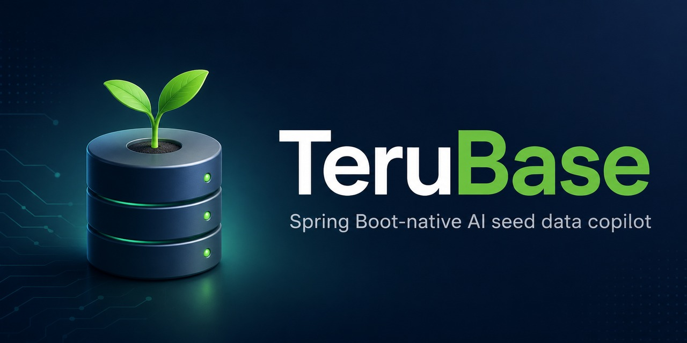
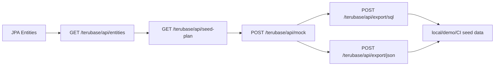

<h1 align="center">TeruBase</h1>

<p align="center">
  
</p>

<p align="center">
  TeruBase makes Spring Boot apps feel alive in minutes.
</p>

<p align="center">
  
  
  
  
  <a href="https://github.com/AbaSheger/TeruBase/actions/workflows/maven.yml">
    
  </a>
</p>

TeruBase is a Spring Boot-native AI seed-data copilot. It discovers JPA
entities, builds relationship-aware seed plans, and exports reviewable seed SQL
for local development, demos, QA scenarios, and CI fixtures.

> From JPA entities to realistic runnable seed data in minutes.

TeruBase is local-first tooling. It is not a generic fake-data generator, an H2
console clone, a production database API, or an enterprise test-data-management
platform.

## Why TeruBase?

- Avoid boring manual `data.sql` work.
- Make local apps and demos look realistic.
- Generate relationship-aware seed plans from JPA entities.
- Keep AI-generated SQL export-first and reviewable.
- Avoid production data in local and dev workflows.

## Try It in 5 Minutes

TeruBase requires Java 21 and Spring Boot 3.4+.

Install this starter into your local Maven cache:

```bash
git clone https://github.com/AbaSheger/TeruBase.git
cd TeruBase
mvn -B -ntp clean install
```

Add the starter to a Spring Boot application:

```xml
<dependency>
    <groupId>com.terubase</groupId>
    <artifactId>terubase-spring-boot-starter</artifactId>
    <version>0.1.0-SNAPSHOT</version>
</dependency>
```

Add local-only configuration to `application-local.yml`:

```yaml
terubase:
  enabled: true
  entity-base-package: com.example.store.domain
  sql-execution-enabled: false
```

Start the application with the `local` profile, then inspect the built-in
scenarios:

```bash
curl http://localhost:8080/terubase/api/scenarios
```

Generate a seed plan from your discovered JPA entities:

```bash
curl "http://localhost:8080/terubase/api/seed-plan?scenarioId=saas-billing-demo&count=30"
```

The seed-plan response is metadata-only. It does not call AI or execute SQL.
Copy its `recommendedMockRequest` into `POST /terubase/api/mock` when you want
AI-generated SQL. The generated request keeps `execute=false`.

## Try the Invoice Demo

Install the local starter first:

```bash
mvn -B -ntp clean install
```

Then run the example Spring Boot app:

```bash
cd examples/invoice-demo
mvn -B -ntp spring-boot:run
```

See [`examples/invoice-demo/README.md`](examples/invoice-demo/README.md) for
curl examples and details.

## Workflow



## Endpoints

| Method | Endpoint | Purpose |
| --- | --- | --- |
| `GET` | `/terubase/api/entities` | Discover JPA entity metadata. |
| `GET` | `/terubase/api/scenarios` | List built-in scenario templates. |
| `GET` | `/terubase/api/seed-plan` | Build an AI-ready seed plan. |
| `POST` | `/terubase/api/mock` | Generate export-first AI seed SQL. |
| `POST` | `/terubase/api/export/sql` | Export reviewed `INSERT` statements as SQL. |
| `POST` | `/terubase/api/export/json` | Export reviewed `INSERT` statements as JSON. |
| `GET` | `/terubase/api/status` | Check isolated SQL service status. |
| `POST` | `/terubase/api/execute` | Execute SQL when explicitly enabled. |

## Safety Defaults

> Keep TeruBase local, export-first, and separate from production data.

- Use TeruBase only with `local`, `dev`, or `test` profiles.
- Never expose `/terubase/api/**` publicly.
- Never use real production records in prompts or examples.
- Keep AI generation export-first with `"execute": false`.
- Review generated SQL before optional isolated execution.
- Keep `sql-execution-enabled` disabled unless direct local SQL access is needed.
- Keep `force-enable-in-production` disabled.

## Configuration

The complete example is
[`application-terubase-example.yml`](terubase-spring-boot-starter/src/main/resources/application-terubase-example.yml).
All settings are flat `terubase.*` properties:

```yaml
terubase:
  enabled: true
  jdbc-url: jdbc:h2:mem:terubase_isolated_db;DB_CLOSE_DELAY=-1;MODE=PostgreSQL;DATABASE_TO_LOWER=TRUE;DEFAULT_NULL_ORDERING=HIGH
  username: sa
  password: ""
  entity-base-package: com.example.store.domain
  open-ai-chat-completions-url: https://api.openai.com/v1/chat/completions
  open-ai-model: gpt-4o
  max-mock-rows: 100
  sql-execution-enabled: false
  force-enable-in-production: false
```

TeruBase auto-configuration is blocked when the `prod` or `production` Spring
profile is active. An intentional override requires:

```yaml
terubase:
  force-enable-in-production: true
```

## Main Workflow

### Discover Entities

```http
GET /terubase/api/entities
```

TeruBase scans `terubase.entity-base-package` and returns JPA metadata for
columns, IDs, generated values, enums, relationships, join columns, join
tables, and deterministic insert-order hints. The hints guide seed generation;
they are not a full database dependency planner.

### Choose a Scenario

```http
GET /terubase/api/scenarios
GET /terubase/api/scenarios/{id}
```

Built-in IDs:

- `ecommerce-demo`
- `saas-billing-demo`
- `crm-demo`
- `banking-lite-demo`
- `task-management-demo`
- `qa-edge-cases`
- `frontend-dashboard-demo`

### Build an AI-Ready Seed Plan

```http
GET /terubase/api/seed-plan?scenarioId=saas-billing-demo&count=30
```

The response combines scenario intent with discovered metadata and returns a
`schemaPrompt` plus a `recommendedMockRequest`. This endpoint does not require
an API key and does not call AI.

### Generate Export-First Seed SQL

```http
POST /terubase/api/mock
Content-Type: application/json

{
  "count": 20,
  "apiKey": "your-local-api-key",
  "schema": "<schemaPrompt from /terubase/api/seed-plan>",
  "scenario": "Generate a fictional SaaS billing demo with overdue invoices",
  "dialect": "h2-postgresql-mode",
  "execute": false
}
```

`execute=false` returns SQL for review without running it. TeruBase accepts only
`INSERT` statements from AI output. It blocks unsupported or destructive SQL.
API keys are request-only: never commit, store, or log them.

### Export Generated Data

Export reviewed statements as SQL:

```http
POST /terubase/api/export/sql
Content-Type: application/json

{
  "statements": [
    "insert into customer (id, name) values (1, 'Sara')"
  ],
  "filename": "demo-seed.sql"
}
```

Or as JSON:

```http
POST /terubase/api/export/json
Content-Type: application/json

{
  "scenario": "Fictional SaaS billing demo",
  "statements": [
    "insert into customer (id, name) values (1, 'Sara')"
  ]
}
```

Export endpoints do not execute SQL or write files to disk. They accept only
`INSERT` statements and return content for review, local seed files, CI
fixtures, and demos.

### Optional Local Execution

AI-generated SQL can run against TeruBase's isolated H2 database by setting
`"execute": true` in `POST /terubase/api/mock`. Batch execution is transactional
and rolls back on failure.

For direct local SQL access, explicitly enable:

```yaml
terubase:
  sql-execution-enabled: true
```

Then use:

```http
GET /terubase/api/status

POST /terubase/api/execute
Content-Type: application/json

{
  "sql": "select 1 as value"
}
```

## Build

```bash
mvn -B -ntp clean verify
```

## License

MIT License.
