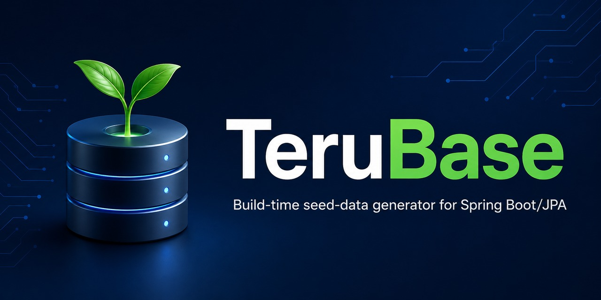
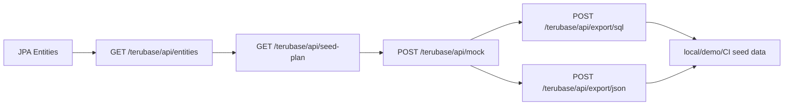

<h1 align="center">TeruBase</h1>

<p align="center">
  
</p>

<p align="center">
  Build-time JPA metadata planning and reviewed SQL export for Maven projects.
</p>

<p align="center">
  
  
  
  
  <a href="https://central.sonatype.com/artifact/io.github.abasheger/terubase-maven-plugin/0.1.1">
    
  </a>
  <a href="https://github.com/AbaSheger/TeruBase/actions/workflows/maven.yml">
    
  </a>
</p>

TeruBase is a Maven plugin that inspects compiled, field-annotated JPA entities,
writes schema-context and seed-plan files, checks that reviewed SQL contains
only `INSERT` statements, and copies it to Spring Boot `data.sql` or a Flyway
migration path.

The preferred path is the Maven plugin. It discovers JPA entities at build time
and writes reviewable artifacts without requiring an AI account:

```xml
<plugin>
  <groupId>io.github.abasheger</groupId>
  <artifactId>terubase-maven-plugin</artifactId>
  <version>0.1.1</version>
</plugin>
```

```bash
mvn -B -ntp compile terubase:plan
```

```text
target/terubase/schema-context.json
target/terubase/seed-plan.md
```

The command also prints an AI handoff: the files an AI tool must be able to
read, a short instruction, the expected SQL save path, and the export commands.

The plugin does not generate row values or call an AI provider. Create
`target/terubase/generated-seed.sql` yourself or with an AI assistant, review
it, then export it as Spring Boot's familiar `data.sql`:

```bash
mvn -B -ntp terubase:export-data-sql
```

```text
src/main/resources/data.sql
```

If Hibernate creates your schema with `spring.jpa.hibernate.ddl-auto`, also set
`spring.jpa.defer-datasource-initialization=true` so Spring runs `data.sql`
after the tables exist.

Projects using Flyway can instead run `mvn -B -ntp terubase:export-flyway`.

TeruBase is local-first tooling. It is not a generic fake-data generator, an H2
console clone, a production database API, or an enterprise test-data-management
platform.

The runtime starter remains available as an optional local playground. The
Maven plugin can copy reviewed SQL to a Flyway migration path, but it does not
run Flyway or replace a migration tool.

## Why TeruBase?

- Write deterministic JSON and Markdown artifacts from compiled JPA classes.
- Record IDs, generated values, Java enums, explicit `@Column` metadata, and
  common relationship annotation types.
- Print a clear handoff for creating SQL with a developer's chosen AI tool.
- Reject blank exports and statements that are not `INSERT` statements.
- Copy reviewed SQL to Spring Boot `data.sql` or a fixed Flyway migration path.

## Working With AI Coding Assistants

Codex, Copilot, Cursor, Claude, ChatGPT, and other coding assistants can draft
seed SQL. TeruBase complements them by providing a deterministic workflow around
the generated output.

The Maven plugin:

- scans your compiled Spring Boot/JPA model
- records explicit `@Table` and `@Column` names, Java enums, IDs, generated
  values, and common relationship annotation types
- creates reusable schema-context and seed-plan artifacts
- checks reviewed SQL as `INSERT`-only
- copies reviewed SQL into `data.sql` or a Flyway migration path
- keeps AI optional and export-first

The assistant remains responsible for drafting row values. TeruBase supplies
project metadata and planning artifacts, checks the reviewed result as
`INSERT`-only, and copies it to the selected Spring Boot or Flyway path.

See [AI coding assistants and TeruBase](docs/AI_ASSISTANTS_AND_TERUBASE.md) for the
division of responsibilities.

## Try It in 5 Minutes

TeruBase requires Java 21. The runtime starter is built and tested with Spring
Boot 3.4.6; compatibility with later Spring Boot releases is not yet claimed.

Add the Maven plugin to a Spring Boot/JPA project's `pom.xml`:

```xml
<build>
  <plugins>
    <plugin>
      <groupId>io.github.abasheger</groupId>
      <artifactId>terubase-maven-plugin</artifactId>
      <version>0.1.1</version>
      <configuration>
        <entityBasePackage>com.example.yourapp</entityBasePackage>
      </configuration>
    </plugin>
  </plugins>
</build>
```

Run the goal from the Maven module whose compiled output contains the entity
classes. The current goal does not aggregate entity classes from child modules.

Generate non-AI planning artifacts from compiled project classes:

```bash
mvn -B -ntp compile terubase:plan
```

This writes:

```text
target/terubase/schema-context.json
target/terubase/seed-plan.md
```

The terminal prints this instruction with absolute paths to the two generated
files:

```text
Generate INSERT-only seed SQL using <schema-context.json> and <seed-plan.md>. Follow the relationships, constraints, row count, and SQL dialect in those files. Return SQL only.
```

A terminal AI agent may be able to read those paths. For a browser chat, upload
both files first; pasting local paths alone does not give the chat access.

To copy a reviewed `target/terubase/generated-seed.sql` file into Spring Boot's
`data.sql`:

```bash
mvn -B -ntp terubase:export-data-sql
```

This writes:

```text
src/main/resources/data.sql
```

For applications where Hibernate creates the schema, configure:

```yaml
spring:
  jpa:
    defer-datasource-initialization: true
```

For a Flyway migration instead:

```bash
mvn -B -ntp terubase:export-flyway
```

AI generation is not built into the Maven plugin. You can use any AI assistant
to draft SQL from the generated artifacts, or use the optional runtime starter's
OpenAI-compatible endpoint.

### Maven Plugin Limits

- Entity inspection recognizes Jakarta Persistence (`jakarta.persistence`)
  annotations. It does not recognize legacy `javax.persistence` annotations.
- The goal scans only the current Maven project's compiled output directory. In
  a multi-module build, run it in the module containing the entities.
- When `entityBasePackage` is omitted, the package filter defaults to the
  current project's `groupId`, or `com` when no group ID is available.
- Entity inspection supports field annotations, not JPA property access. It
  currently records every non-static field and does not exclude fields marked
  `@Transient`.
- An explicit `@Table` name is recorded; otherwise `tableName` falls back to the
  Java class name. Fields always include their Java names, while column metadata
  is present only for explicit `@Column` annotations. The plugin does not apply
  a Hibernate physical naming strategy.
- The plugin records common relationship annotation types, but not `@JoinColumn`
  or `@JoinTable` details.
- The plan always includes generic insert-order text, including a join-table
  hint. Those lines are instructions, not proof that matching metadata was
  discovered, and they are not a foreign-key dependency graph.
- The configured row count and dialect are written into the plan for the SQL
  author or AI tool; the plugin does not enforce either one.
- SQL checking is syntactic and `INSERT`-only. It does not connect to the host
  database or verify tables, columns, constraints, values, or dialect syntax.
- Export goals overwrite their configured output file.
- `terubase:plan` fails when it discovers no entities. Compile the module that
  contains the entities and verify `entityBasePackage` when this happens.

### Example Output

A compact `schema-context.json` looks like this:

```json
{
  "entities": [
    {
      "className": "com.example.invoice.Customer",
      "simpleName": "Customer",
      "tableName": "customers",
      "fields": [
        {
          "name": "id",
          "type": "java.lang.Long",
          "id": true,
          "generatedValue": true
        },
        {
          "name": "email",
          "type": "java.lang.String",
          "column": {
            "name": "email",
            "nullable": false,
            "unique": true
          }
        }
      ],
      "insertOrderHint": "Parent or reference entity; insert before dependent child entities."
    }
  ]
}
```

The matching `seed-plan.md` records the configured scenario, count, dialect,
discovered entities, and basic hints:

```markdown
# TeruBase Seed Plan

- Scenario: Generate realistic relationship-aware local development seed data.
- Target row count: 20
- SQL dialect: h2-postgresql-mode
- Discovered entities: 3

## Insert Order Hints

- Insert parent and reference tables first.
- Insert child tables with foreign keys second.
- Insert join tables last.
- Populate every nullable=false field.
```

After review, `terubase:export-data-sql` checks the file as `INSERT`-only and
copies it into `data.sql`:

```sql
-- TeruBase seed data
INSERT INTO customers (id, name, email) VALUES (1, 'Northstar Studio', 'billing@northstar.example');
INSERT INTO invoices (id, customer_id, invoice_number, total_amount) VALUES (10, 1, 'INV-2026-0001', 1200.00);
```

### Optional Starter Playground

Add the starter to a Spring Boot application when you want the local runtime
playground endpoints:


```xml
<dependency>
    <groupId>io.github.abasheger</groupId>
    <artifactId>terubase-spring-boot-starter</artifactId>
    <version>0.1.1</version>
</dependency>
```

Add local-only configuration to `application-local.yml`:

```yaml
terubase:
  enabled: true
  entity-base-package: com.example.store.domain
  sql-execution-enabled: false
```

The runtime starter is disabled unless `terubase.enabled=true` is set.

Start the application with the `local` profile, then inspect the built-in
scenarios:

```bash
curl http://localhost:8080/terubase/api/scenarios
```

Generate a seed plan from your discovered JPA entities:

```bash
curl "http://localhost:8080/terubase/api/seed-plan?scenarioId=saas-billing-demo&count=30"
```

The seed-plan response is metadata-only. It does not call AI or execute SQL.
Copy its `recommendedMockRequest` into `POST /terubase/api/mock` when you want
AI-generated SQL. The generated request keeps `execute=false`.

## Try the Invoice Demo

Generate Maven plugin artifacts from the invoice demo:

```bash
cd examples/invoice-demo
mvn -B -ntp compile terubase:plan
```

This writes:

```text
examples/invoice-demo/target/terubase/schema-context.json
examples/invoice-demo/target/terubase/seed-plan.md
```

To export reviewed SQL to `data.sql`, place reviewed `INSERT` statements in
`examples/invoice-demo/target/terubase/generated-seed.sql`, then run:

```bash
mvn -B -ntp terubase:export-data-sql
```

This writes:

```text
examples/invoice-demo/src/main/resources/data.sql
```

Use `mvn -B -ntp terubase:export-flyway` instead when the project uses Flyway.

You can also run the example Spring Boot app and use the local runtime
playground endpoints:

```bash
mvn -B -ntp spring-boot:run
```

See [`examples/invoice-demo/README.md`](examples/invoice-demo/README.md) for
plugin output, curl examples, and details.

## Workflow



The plugin workflow is build-time only: compiled JPA classes become
schema-context and seed-plan files, then reviewed SQL is checked and copied to
`data.sql` or the configured Flyway path. The plugin does not call an AI
provider.

## Endpoints

| Method | Endpoint | Purpose |
| --- | --- | --- |
| `GET` | `/terubase/api/entities` | Discover JPA entity metadata. |
| `GET` | `/terubase/api/scenarios` | List built-in scenario templates. |
| `GET` | `/terubase/api/scenarios/{id}` | Get one built-in scenario template. |
| `GET` | `/terubase/api/seed-plan` | Build an AI-ready seed plan. |
| `POST` | `/terubase/api/mock` | Generate export-first AI seed SQL. |
| `POST` | `/terubase/api/export/sql` | Export reviewed `INSERT` statements as SQL. |
| `POST` | `/terubase/api/export/json` | Export reviewed `INSERT` statements as JSON. |
| `GET` | `/terubase/api/status` | Check isolated SQL service status. |
| `POST` | `/terubase/api/execute` | Execute SQL when explicitly enabled. |

## Safety Defaults

> Keep TeruBase local, export-first, and separate from production data.

- Use TeruBase only with `local`, `dev`, or `test` profiles.
- Never expose `/terubase/api/**` publicly.
- Never use real production records in prompts or examples.
- Keep AI generation export-first with `"execute": false`.
- Review generated SQL before optional isolated execution.
- Keep `sql-execution-enabled` disabled unless direct local SQL access is needed.
- Keep `force-enable-in-production` disabled.

## Configuration

The complete example is
[`application-terubase-example.yml`](terubase-spring-boot-starter/src/main/resources/application-terubase-example.yml).
All settings are flat `terubase.*` properties:

```yaml
terubase:
  enabled: true
  jdbc-url: jdbc:h2:mem:terubase_isolated_db;DB_CLOSE_DELAY=-1;MODE=PostgreSQL;DATABASE_TO_LOWER=TRUE;DEFAULT_NULL_ORDERING=HIGH
  username: sa
  password: ""
  entity-base-package: com.example.store.domain
  open-ai-chat-completions-url: https://api.openai.com/v1/chat/completions
  open-ai-model: gpt-4o
  max-mock-rows: 100
  sql-execution-enabled: false
  force-enable-in-production: false
```

TeruBase auto-configuration is blocked when the `prod` or `production` Spring
profile is active. It is also disabled by default in every profile. Enable it
explicitly for local use with `terubase.enabled=true`. An intentional
production override requires both:

```yaml
terubase:
  enabled: true
  force-enable-in-production: true
```

## Main Workflow

### Discover Entities

```http
GET /terubase/api/entities
```

When `terubase.entity-base-package` is set, TeruBase scans that package. When it
is omitted, the runtime starter derives candidate packages from application
bean definitions and falls back to `com` if none are found. It returns JPA
metadata for columns, IDs, generated values, enums, relationships, join
columns, join tables, and deterministic insert-order hints. The hints guide
seed generation; they are not a full database dependency planner.

Runtime metadata inspection is also field-based. It does not inspect
property/getter mappings, apply Hibernate physical naming strategies, or
exclude fields marked `@Transient`.

### Choose a Scenario

```http
GET /terubase/api/scenarios
GET /terubase/api/scenarios/{id}
```

Built-in IDs:

- `ecommerce-demo`
- `saas-billing-demo`
- `crm-demo`
- `banking-lite-demo`
- `task-management-demo`
- `inventory-management-demo`
- `learning-management-demo`
- `event-registration-demo`
- `qa-edge-cases`
- `frontend-dashboard-demo`

### Build an AI-Ready Seed Plan

```http
GET /terubase/api/seed-plan?scenarioId=saas-billing-demo&count=30
```

The response combines scenario intent with discovered metadata and returns a
`schemaPrompt` plus a `recommendedMockRequest`. This endpoint does not require
an API key and does not call AI. Its `count` cannot exceed
`terubase.max-mock-rows`, so the recommended request is accepted by `/mock`.

### Generate Export-First Seed SQL

```http
POST /terubase/api/mock
Content-Type: application/json

{
  "count": 20,
  "apiKey": "your-local-api-key",
  "schema": "<schemaPrompt from /terubase/api/seed-plan>",
  "scenario": "Generate a fictional SaaS billing demo with overdue invoices",
  "dialect": "h2-postgresql-mode",
  "execute": false
}
```

`execute=false` returns SQL for review without running it. TeruBase accepts only
`INSERT` statements from AI output. It blocks unsupported or destructive SQL.
API keys are request-only: never commit, store, or log them.

### Export Generated Data

Export reviewed statements as SQL:

```http
POST /terubase/api/export/sql
Content-Type: application/json

{
  "statements": [
    "insert into customer (id, name) values (1, 'Sara')"
  ],
  "filename": "demo-seed.sql"
}
```

Or as JSON:

```http
POST /terubase/api/export/json
Content-Type: application/json

{
  "scenario": "Fictional SaaS billing demo",
  "statements": [
    "insert into customer (id, name) values (1, 'Sara')"
  ]
}
```

Export endpoints do not execute SQL or write files to disk. They accept only
`INSERT` statements and return content for review, local seed files, CI
fixtures, and demos.

### Optional Local Execution

AI-generated SQL can run against TeruBase's isolated H2 database by setting
`"execute": true` in `POST /terubase/api/mock`. Batch execution is transactional
and rolls back on failure.

For direct local SQL access, explicitly enable:

```yaml
terubase:
  sql-execution-enabled: true
```

Then use:

```http
GET /terubase/api/status

POST /terubase/api/execute
Content-Type: application/json

{
  "sql": "select 1 as value"
}
```

## Build

```bash
mvn -B -ntp clean verify
```

## License

MIT License.
